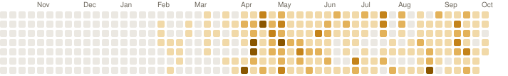

# Dan Sedano

AI and backend engineer in San Diego, CA. I build agent systems and the services behind them, mostly in Python and Rust.

[Message me on LinkedIn](https://linkedin.com/in/sdedano) · [dsedano.dev](https://dsedano.dev)

<picture>
  <source media="(prefers-color-scheme: dark)" srcset="assets/calendar-dark.svg">
  
</picture>

**2,682** contributions and **153** pull requests in the last 12 months, counting private work.

## Featured work

**[enphase-bridge](https://github.com/thedandano/enphase-bridge)** · Rust · updated Oct 6, 2026 
Self-hosted Enphase IQ Gateway bridge — local REST API, SQLite storage, optional Bearer token auth

**[enphase-bridge-dashboard](https://github.com/thedandano/enphase-bridge-dashboard)** · TypeScript · updated Oct 5, 2026 
React + TypeScript dashboard for the enphase-bridge solar energy daemon

## Open-source work

- [iOS: pre-fill the weigh-in from Apple Health](https://github.com/DuarteSantos8/openGym/pull/463) · DuarteSantos8/openGym · pull request, open
- [fix(rocm): pure-torch moe\_align\_block\_size on gfx1101 (Triton 3.8.0 miscompile)](https://github.com/zihaomu/FreeToken/pull/1) · zihaomu/FreeToken · pull request, open
- [Fix memory estimate for sage, flash and comfy kitchen attention](https://github.com/Comfy-Org/ComfyUI/pull/16116) · Comfy-Org/ComfyUI · pull request, open
- [\[Release\]\[Cherry-Pick\] \[AMD\] Fix empty range inference for HistogramOp in Range…](https://github.com/triton-lang/triton/pull/11577) · triton-lang/triton · pull request, open
- [memory\_required() estimate misses masked attention fallback and per-model atten…](https://github.com/Comfy-Org/ComfyUI/issues/16021) · Comfy-Org/ComfyUI · issue, open
- [--use-flash-attention is ignored by the memory estimator, causing a 7.5x overes…](https://github.com/Comfy-Org/ComfyUI/issues/15585) · Comfy-Org/ComfyUI · issue, open

Rebuilt daily by [a script in this repo](build.py). Last run Oct 8, 2026.
