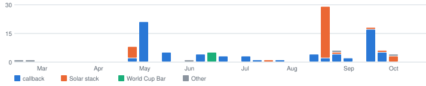

# I don't let go of a problem, I ship, and I keep it simple.

**Tenacious.** In [callback](https://github.com/thedandano/callback), a test case that had always passed suddenly failed. I re-ran it twice against the old version to prove the cause was the AI model's randomness and not my change. [I wrote it down in the repo.](https://github.com/thedandano/callback/blob/1be24db29568d6c5ed2a65221f0be361abcd1920/CLAUDE.md#L83-L94)

**Action oriented.** [124 merged pull requests](https://github.com/search?q=author%3Athedandano+is%3Apr+is%3Amerged+is%3Apublic+merged%3A%3E%3D2025-10-08&type=pullrequests) in public repos in the last 12 months, across Python, Rust, TypeScript, and Swift. [callback](https://github.com/thedandano/callback/releases) has shipped 19 releases, most recently v1.8.0.

**Pragmatic.** callback [grades resumes with plain rules](https://github.com/thedandano/callback/blob/main/callback/scorer.py), not another AI call, so the same resume always gets the same score. [enphase-bridge](https://github.com/thedandano/enphase-bridge) keeps solar data in one SQLite file and is small enough to run on a Raspberry Pi.

## What I build

**[callback](https://github.com/thedandano/callback)** rewrites a resume for one job posting. It scores the resume against the posting, tailors it using only evidence you have given it, and hands back a PDF. It never invents experience.

**The solar stack** is how I own my home solar data. [enphase-bridge](https://github.com/thedandano/enphase-bridge) collects it, [a dashboard](https://github.com/thedandano/enphase-bridge-dashboard) charts every panel, and [a plugin](https://github.com/thedandano/enphase-bridge-plugin#what-this-does) lets me ask an AI "how's my solar today?" in plain English.

**[World Cup Bar](https://github.com/thedandano/world-cup-kickoff-bar)** puts live World Cup scores in the Mac menu bar. It needs no browser tab, it works offline, and your settings never leave your Mac.

## Where the work went

<picture>
  <source media="(prefers-color-scheme: dark)" srcset="assets/work-dark.svg">
  
</picture>

Merged pull requests by week since Feb 2026. Totals, in the order the bars stack from the bottom: callback 74, Solar stack 40, World Cup Bar 5, Other 5.

The same numbers as a table

| Week of | callback | Solar stack | World Cup Bar | Other |
| --- | ---: | ---: | ---: | ---: |
| Feb 16, 2026 | 0 | 0 | 0 | 1 |
| Feb 23, 2026 | 0 | 0 | 0 | 1 |
| Apr 27, 2026 | 2 | 6 | 0 | 0 |
| May 4, 2026 | 21 | 0 | 0 | 0 |
| May 18, 2026 | 5 | 0 | 0 | 0 |
| Jun 1, 2026 | 0 | 0 | 0 | 1 |
| Jun 8, 2026 | 4 | 0 | 0 | 0 |
| Jun 15, 2026 | 0 | 0 | 5 | 0 |
| Jun 22, 2026 | 3 | 0 | 0 | 0 |
| Jul 6, 2026 | 3 | 0 | 0 | 0 |
| Jul 13, 2026 | 1 | 0 | 0 | 0 |
| Jul 20, 2026 | 0 | 1 | 0 | 0 |
| Jul 27, 2026 | 1 | 0 | 0 | 0 |
| Aug 17, 2026 | 4 | 0 | 0 | 0 |
| Aug 24, 2026 | 2 | 27 | 0 | 0 |
| Aug 31, 2026 | 4 | 1 | 0 | 1 |
| Sep 7, 2026 | 2 | 0 | 0 | 0 |
| Sep 21, 2026 | 17 | 1 | 0 | 0 |
| Sep 28, 2026 | 5 | 1 | 0 | 0 |
| Oct 5, 2026 | 0 | 3 | 0 | 1 |

## How I work

**Catch it early.** My projects check code on my machine before it leaves, then again on GitHub. See the hooks in [callback](https://github.com/thedandano/callback/blob/main/.pre-commit-config.yaml), [enphase-bridge](https://github.com/thedandano/enphase-bridge/tree/main/.githooks), and [the dashboard](https://github.com/thedandano/enphase-bridge-dashboard/tree/main/.husky).

**Keep it clean.** A linter fails the build when a function gets too complicated. [The rule is two lines.](https://github.com/thedandano/callback/blob/1be24db29568d6c5ed2a65221f0be361abcd1920/pyproject.toml#L51-L52)

**Start from the user.** My goal is always something easy and pleasant to use. That is why the solar plugin [answers in plain English](https://github.com/thedandano/enphase-bridge-plugin#what-this-does) and World Cup Bar stays out of your way until your team plays.

## Away from the keyboard

**Solar.** I am a huge fan of clean energy, and of paying my electric company less. My projects chart where my energy goes. Next I want them to act on it, like charging my car at the best time based on my solar credits.

**Dog rescue.** I am an animal lover with three cats, and Pitbulls always have a place in my heart. As a former Pitbull foster, I knew the rescue's technology could use some improvements, so I volunteer my engineering skills for [itsthepits.org](https://itsthepits.org). Stay tuned for the new site. I am also building internal tools to help with their day-to-day.

**Strength training.** I am new to it and very data driven, and most apps I tried did not satisfy that. [openGym](https://github.com/DuarteSantos8/openGym) did, and I love that you can host it yourself. I have been slowly adding the things I think should be better: [one fix merged](https://gitlab.com/DuarteSantos8/opengym/-/merge_requests/125) and [another landed](https://github.com/DuarteSantos8/openGym/commit/6db9873928fc54797aa7411aa8afc53df4d23782).

[Message me on LinkedIn](https://linkedin.com/in/sdedano)

Rebuilt daily by [a script in this repo](build.py). Last run Oct 8, 2026.
